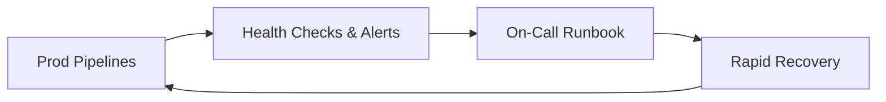

# McKinsey-Data-Scientist

**Role:** Data Scientist (Full-Time: 40 hrs/wk)  
**When:** Jan. 2025 – Jan. 2026 *(expected)* · **Location:** Taipei, Taiwan  

> **Disclaimer:** This portfolio uses sanitized descriptions and **synthetic examples only**.  
> No proprietary code, data, screenshots, internal IDs, or client configurations are included.

---

## Projects at a Glance

| Project | Problem | What I Built | Result | Stack |
|---|---|---|---|---|
| **P1. Data Platform Reliability & Recovery** | Manual checks and slow incident response around dashboards/pipelines | Health checks, alerting, and a rapid-recovery runbook | **Manual monitoring ↓ ~8 hrs/week** | **Python**, **BigQuery SQL**, Alerts/Monitors, Runbooks |
| **P2. Search-Ad KPI Analytics for Exec Readouts** | Fragmented KPI logic slowed decision cycles | Decision-grade BigQuery SQL with consultants; weekly exec readouts | Growth opportunities surfaced; faster weekly decisions | **BigQuery SQL**, BI Dashboards |
| **P3. SQL Refactor & Ingestion/Extraction Pipelines** | Costly, slow queries; ad-hoc data pulls | Refactored SQL; automated ingest/extract pipelines reused across workstreams | **Query runtime & cost ↓ ~40%**; pipelines power **~95%** of analyses | **BigQuery SQL**, **Python** |
| **P4. Relevance-Scoring API (SEO: Keyword ↔ Product)** | Slow A/B iteration on ranking quality | Python API scoring keyword–product pairs for SEO model | **A/B cadence ↑ 1 → 3 tests/week** | **Python**, REST API, Pandas/NumPy |
| **P5. Event-Driven Ad-Traffic Collector** | High latency and manual pulls | Automated event-driven collector in Python | **Retrieval latency ↓ ~88%** | **Python**, Schedulers/Jobs, HTTP/CSV |
| **P6. Incentive Targeting for Mid/Long-Tail Vendors** | Low activation in target segment | Pattern analysis of ad-setting behaviors; targeting design with strategy team | **Activation rate ↑ ~13%** | **BigQuery SQL**, **Python**, Experiment Design |

---

## Project Details

### P1 — Data Platform Reliability & Recovery
**Problem.** Manual checks for dashboard/pipeline health created toil and slowed incident response.  
**Solution.** Introduced programmatic **health checks**, **alerting**, and a **rapid-recovery runbook** for on-call.

**Highlights**
- Proactive monitors on SLIs/SLOs (freshness, latency, failure rates).
- Alert routing with clear ownership and escalation path.
- Recovery playbooks with verifications and post-incident notes.

**Impact**
- **Manual monitoring reduced ~8 hrs/week** while improving mean-time-to-recover.

---

### P2 — Search-Ad KPI Analytics for Executive Readouts
**Problem.** KPI definitions were fragmented; weekly decisions stalled on manual queries.  
**Solution.** Co-developed **decision-grade BigQuery SQL** with consultants; standardized KPI logic for **weekly executive readouts**.

**Highlights**
- Unified KPI layer (spend, clicks, CTR/CPC/ROAS, cohort views).
- Reusable parameterized queries for weekly/MTD/YTD cuts.
- Clear audit trail of metric definitions for stakeholders.

**Impact**
- Consistent metrics and **faster weekly decisions**; surfaced concrete **e-commerce ad revenue opportunities**.

---

### P3 — SQL Refactor & Ingestion/Extraction Pipelines
**Problem.** Queries were costly/slow; repeated ad-hoc pulls.  
**Solution.** Refactored the SQL codebase; shipped automated **ingestion/extraction pipelines** reused across analyses and dashboards.

**Highlights**
- Partitioning, clustering, and predicate pushdown.
- Common CTE library and tested macros.
- Scheduled ingest/extract with schema contracts.

**Impact**
- **Runtime & cost ↓ ~40%**; pipelines underpin **~95%** of analyses/dashboards.

---

### P4 — Relevance-Scoring API (SEO: Keyword ↔ Product)
**Problem.** Ranking tweaks were bottlenecked; A/B tests ran ~1/week.  
**Solution.** A **Python REST API** that scores keyword–product pairs for SEO relevance and feeds the ranking pipeline.

**Highlights**
- Deterministic scoring with unit tests and simple offline evals.
- Lightweight schema; backfills and shadow deploys for safety.
- Easy integration with A/B platform.

**Impact**
- **A/B iteration ↑ from ~1 → 3 tests/week**, accelerating learning cycles.

---

### P5 — Event-Driven Ad-Traffic Collector
**Problem.** Ad-traffic retrieval was slow and manual, delaying downstream analytics.  
**Solution.** **Event-driven Python collector** with incremental fetch, retries, and idempotent writes.

**Highlights**
- Checkpointing to avoid duplicates; backoff/retry for flaky sources.
- Incremental loads that land ready-to-query.
- Simple ops dashboard for freshness and lag.

**Impact**
- **Retrieval latency ↓ ~88%**; fresher inputs for KPIs and experiments.

---

### P6 — Incentive Targeting for Mid/Long-Tail Vendors
**Problem.** Activation lagged in mid/long-tail vendor segments.  
**Solution.** Analyzed **ad-setting patterns** and partnered with the client strategy team to design **incentive targeting**.

**Highlights**
- Feature cuts by vendor cohort, spend tier, and adtype mix.
- Hypothesis-driven segmentation; simple uplift checks.
- Rollout plan aligned with client ops cadence.

**Impact**
- **Activation rate ↑ ~13%** in targeted cohorts.

---

## Impact Highlights (Summary)
- Ops & reliability: **–8 hrs/week** manual monitoring; faster incident recovery.  
- Analytics foundation: Unified **BigQuery** KPI layer enabling **weekly exec decisions**.  
- Efficiency: SQL refactor + pipelines → **–40%** runtime/cost; coverage of **~95%** analyses.  
- Experiment velocity: Relevance API → **1 → 3** A/B tests per week.  
- Data freshness: Event-driven collector → **–88%** latency.  
- Growth: Incentive targeting → **+13%** activation in focus segments.

---

## Ops & Experimentation Loops (Simplified)

