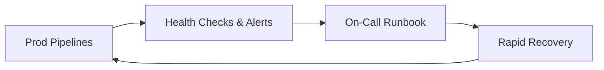

# McKinsey-Data-Scientist

**Role:** Data Scientist (Full-Time: 40 hrs/wk)  
**When:** Jan. 2025 – Jan. 2026 *(expected)* · **Location:** Taipei, Taiwan  

> **Disclaimer:** This portfolio uses sanitized descriptions and **synthetic examples only**.  
> No proprietary code, data, screenshots, internal IDs, or client configurations are included.

---

## Projects at a Glance

| Project | Problem | What I Built | Result | Stack |
|---|---|---|---|---|
| **P1. Data Platform Reliability & Recovery** | Manual checks and slow incident response around dashboards and data pipelines | Health checks, alerting, and rapid-recovery runbook | **Manual monitoring ↓ ~8 hrs/week** | **Python**, **BigQuery SQL** (freshness/latency SLIs), **Monitoring/Alerting**, **Operational Runbooks**, Looker Studio Dashboard |
| **P2. Search-Ad KPI Analytics** | Decision cycles needed a decision-grade data layer and to extract revenue-driving, model-optimizing insights from search-ad data | Decision-grade BigQuery SQL and Python analytics with consultants | Growth opportunities surfaced; faster weekly decisions;  support weekly exec readouts | **BigQuery SQL** (CTEs, window/analytic functions), **Python** (pandas), **Machine Learning (prediction, clustering, classification)**, **Looker Studio Dashboards** |
| **P3. SQL Codebase Refactor & Data Ingestion and Extraction Pipelines** | Costly, slow queries; ad-hoc data pulls | Refactored entire SQL codebase and redefine KPI code; automated ingest and extract pipelines reused across workstreams | **Query runtime & cost ↓ ~40%**; pipelines power **~95%** of analyses | **BigQuery SQL**, **Python**, **Scheduled Jobs** |
| **P4. Keyword Product Relevance-Scoring API with Machine Learning Model for Search Engine Optimization (SEO)** | Slow A/B iteration on relevance ranking and low accuracy in relevance predictions limited gains| Automated Production Python API embedded with a trained machine learning model that scores keyword–product pairs and feeds the SEO ranking pipeline | **A/B cadence ↑ 1 → 3 tests/week** | **Python**, **PyTorch**, **REST API**, **pandas/NumPy**, **Experimentation Platform (A/B)** |
| **P5. Event-Driven Ad-Traffic Collector** | High latency and manual pulls on ad-traffic data | Automated event-driven collector in Python | **Retrieval latency ↓ ~88%** | **Python**, **Job Schedulers**, **HTTP/CSV ingestion** |
| **P6. Incentive Targeting Analytics for Mid/Long-Tail Vendors** | Low activation in ad-ssetting of target segment | Pattern analysis of ad-setting behaviors; targeting design with client's strategy team and consultant| **Activation rate ↑ ~13%** on first month of activation| **BigQuery SQL**, **Python**, **Statistical Analysis**, **Experiment Design** |

---

## Project Details

### P1 — Data Platform Reliability & Recovery
**Problem.** Manual checks for dashboard/pipeline health created toil and slowed incident response.  
**Solution.** Programmatic **health checks** and **alerting** backed by BigQuery-derived SLIs/SLOs, plus a **rapid-recovery runbook**.

**Data/ML-oriented highlights**
- **SLIs/SLOs:** freshness lag, DAG latency, error rates; computed with **BigQuery SQL** window analytics and surfaced in **Looker Studio**.
- **Anomaly detection:** rolling-window thresholds (p90/p95) trigger alerts; noisy spikes damped with simple moving averages.
- **Operations:** runbooks with validation queries, rollback/forward procedures, and post-incident notes for continuous improvement.

**Impact**
- **Manual monitoring ↓ ~8 hrs/week**; faster mean-time-to-detect and mean-time-to-recover.

---

### P2 — Search-Ad KPI Analytics
**Problem.** Fragmented KPI definitions and manual pulls slowed weekly decisions.  
**Solution.** A **decision-grade KPI layer** in BigQuery plus **Python** notebooks for exploration and **Looker** for exec readouts.

**Data/ML-oriented highlights**
- **Metric modeling:** consistent definitions for spend, clicks, CTR/CPC/ROAS, conversion rate; cohort and funnel cuts via window functions.
- **Segmentation & insight mining:** lightweight **clustering/classification** to profile vendors/adtypes; feature engineering for seasonality and device/channel mixes.
- **Decision support:** parameterized SQL for MTD/YTD and promo windows; weekly packs auto-refresh for executive review.

**Impact**
- Clear growth opportunities; **faster weekly decisions**; reliable inputs for experimentation and budget allocation.

---

### P3 — SQL Codebase Refactor & Data Ingestion and Extraction Pipelines
**Problem.** Slow, costly queries and repeated ad-hoc pulls hurt velocity and consistency.  
**Solution.** Refactored SQL and standardized KPI code; shipped **automated ingestion/extraction** with schema contracts.

**Data/ML-oriented highlights**
- **Performance engineering:** partitioning, clustering, predicate pushdown, and common CTE library; query plans validated against baselines.
- **Data quality:** pre/post-load checks (row counts, null ratios, schema drift); Python validators for expectations on key tables.
- **Reproducibility:** scheduled jobs produce versioned, ready-to-query datasets that feed analyses, models, and dashboards.

**Impact**
- **Runtime & cost ↓ ~40%**; pipelines underpin **~95%** of analyses/dashboards.

---

### P4 — Keyword Product Relevance-Scoring API with Machine Learning Model for Search Engine Optimization (SEO)
**Problem.** Ranking tweaks bottlenecked by slow A/B throughput and limited relevance accuracy.  
**Solution.** A **Python REST API** that serves a trained **PyTorch** model to score keyword–product pairs for the SEO ranking pipeline.

**Data/ML-oriented highlights**
- **Modeling:** supervised relevance model with offline evaluation (holdout metrics, calibration checks); deterministic inference for traceability.
- **Serving:** low-latency inference path; schema-validated requests/responses; **shadow deploys** before traffic switch.
- **Experimentation:** tight integration with the **A/B platform**; feature/threshold switches allow controlled rollouts.

**Impact**
- **A/B iteration ↑ from ~1 → 3 tests/week**, accelerating learning and ranking improvements.

---

### P5 — Event-Driven Ad-Traffic Collector
**Problem.** Manual retrieval and laggy availability delayed downstream analytics and experiments.  
**Solution.** **Event-driven Python collector** with incremental fetch, retries, and idempotent writes to ready-to-query tables.

**Data/ML-oriented highlights**
- **Freshness SLI:** BigQuery computes end-to-end ingestion lag; alerts when thresholds are breached.
- **Reliability:** checkpointing keys prevent duplicates; exponential backoff handles flaky sources.
- **Usability:** normalized schemas and partitioned tables enable immediate use by KPIs/models.

**Impact**
- **Retrieval latency ↓ ~88%**; fresher signals for KPIs, model training, and A/B tests.

---

### P6 — Incentive Targeting Analytics for Mid/Long-Tail Vendors
**Problem.** Activation was low in key segments despite ongoing spend.  
**Solution.** Analytical segmentation of **ad-setting patterns** and partnership with strategy/consulting teams to design targeting rules.

**Data/ML-oriented highlights**
- **Segmentation:** cohorting by spend tier, adtype mix, and historical response; simple uplift analyses to prioritize cohorts.
- **Design & evaluation:** experiment blueprint (**experiment design**, guardrails, success metrics), with weekly readouts.
- **Operationalization:** SQL rules and dashboards that ops can apply without code changes; monitoring for post-launch drift.

**Impact**
- **Activation rate ↑ ~13%** in targeted cohorts during first-month rollout.

---

## Impact Highlights (Summary)
- Ops & reliability: **–8 hrs/week** manual monitoring; faster incident recovery.  
- Analytics foundation: Unified **BigQuery** KPI layer enabling **weekly exec decisions**.  
- Efficiency: SQL refactor + pipelines → **–40%** runtime/cost; coverage of **~95%** analyses.  
- Experiment velocity: Relevance API → **1 → 3** A/B tests per week.  
- Data freshness: Event-driven collector → **–88%** latency.  
- Growth: Incentive targeting → **+13%** activation in focus segments.

---

## Ops & Experimentation Loops (Simplified)

